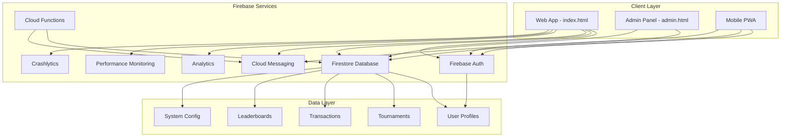

# Design Document

## Overview

This design document outlines the architecture and implementation strategy for integrating Firebase services into the existing ARSON Arena gaming tournament platform. The current platform uses localStorage for data persistence and lacks real-time capabilities. The Firebase integration will provide secure authentication, real-time data synchronization, cloud storage, push notifications, and comprehensive analytics while maintaining the existing user experience and visual design.

The migration strategy will be incremental, allowing the platform to operate in hybrid mode during transition, with fallback mechanisms to ensure reliability.

## Architecture

### High-Level Architecture



### Service Integration Strategy (Firebase Free Tier)

1. **Authentication Layer**: Firebase Auth with custom claims for admin roles (50,000 MAU free)
2. **Data Layer**: Firestore with real-time listeners and offline persistence (1 GiB storage, 50K reads/day, 20K writes/day)
3. **Business Logic**: Minimal Cloud Functions usage (2M invocations/month free) - only for critical operations
4. **Notification Layer**: Firebase Cloud Messaging for real-time updates (unlimited free)
5. **Monitoring Layer**: Basic Analytics and limited Performance monitoring (free tier)

## Components and Interfaces

### 1. Authentication Service

**Purpose**: Manage user authentication and authorization

**Key Components**:
- `AuthManager` class for authentication operations
- Custom claims for admin role management
- Session persistence and token refresh
- Password reset and email verification

**Interface**:
```javascript
class AuthManager {
    async signUp(email, password, username)
    async signIn(email, password)
    async signOut()
    async resetPassword(email)
    async updateProfile(userData)
    getCurrentUser()
    onAuthStateChanged(callback)
    async setAdminClaim(uid, isAdmin)
}
```

### 2. Database Service

**Purpose**: Handle all Firestore operations with real-time synchronization

**Key Components**:
- `DatabaseManager` class for CRUD operations
- Real-time listeners for live updates
- Offline persistence configuration
- Transaction handling for financial operations

**Interface**:
```javascript
class DatabaseManager {
    // User operations
    async createUser(uid, userData)
    async updateUser(uid, updates)
    async getUser(uid)
    onUserChanged(uid, callback)
    
    // Tournament operations
    async createTournament(tournamentData)
    async updateTournament(id, updates)
    async deleteTournament(id)
    onTournamentsChanged(callback)
    
    // Transaction operations
    async createTransaction(transactionData)
    async updateTransactionStatus(id, status)
    onTransactionsChanged(callback)
    
    // Leaderboard operations
    async updateLeaderboard(type, userData)
    onLeaderboardChanged(type, callback)
}
```

### 3. Real-time Notification Service

**Purpose**: Handle real-time updates and push notifications

**Key Components**:
- `NotificationManager` for FCM integration
- Real-time event broadcasting
- In-app notification system
- Push notification scheduling

**Interface**:
```javascript
class NotificationManager {
    async initializeFCM()
    async requestPermission()
    async subscribeToTopic(topic)
    async sendNotification(userId, message)
    async broadcastToAll(message)
    onMessageReceived(callback)
}
```

### 4. Tournament Management Service

**Purpose**: Handle tournament lifecycle and participant management

**Key Components**:
- Tournament creation and validation
- Participant registration and management
- Real-time tournament updates
- Match result processing

**Interface**:
```javascript
class TournamentManager {
    async createTournament(tournamentData)
    async joinTournament(tournamentId, userId)
    async leaveTournament(tournamentId, userId)
    async updateTournamentStatus(tournamentId, status)
    async processMatchResults(tournamentId, results)
    onTournamentUpdated(tournamentId, callback)
}
```

### 5. Wallet Service

**Purpose**: Manage user financial operations securely

**Key Components**:
- Balance management with atomic operations
- Transaction history tracking
- Deposit/withdrawal request handling
- Financial audit trail

**Interface**:
```javascript
class WalletService {
    async getBalance(userId)
    async createDepositRequest(userId, amount, method, transactionId)
    async createWithdrawalRequest(userId, amount, method, account)
    async processDeposit(requestId, adminId)
    async processWithdrawal(requestId, adminId)
    async getTransactionHistory(userId)
    onBalanceChanged(userId, callback)
}
```

## Data Models

### User Profile Schema
```javascript
{
  uid: string,                    // Firebase Auth UID
  email: string,                  // User email
  username: string,               // Display name
  avatar: string,                 // Avatar identifier
  coins: number,                  // Current balance
  xp: number,                     // Experience points
  level: number,                  // User level
  gameUids: {                     // Game-specific IDs
    pubg: string,
    freefire: string
  },
  referralCode: string,           // User's referral code
  referredBy: string,             // Referrer's code
  isAdmin: boolean,               // Admin flag
  createdAt: timestamp,
  updatedAt: timestamp,
  lastActive: timestamp
}
```

### Tournament Schema
```javascript
{
  id: string,                     // Auto-generated ID
  title: string,                  // Tournament name
  game: string,                   // Game type (PUBG Mobile, FreeFire)
  map: string,                    // Game map
  type: string,                   // Solo, Duo, Squad
  entryFee: number,               // Entry cost in coins
  prizePool: string,              // Prize description
  maxParticipants: number,        // Maximum players
  currentParticipants: number,    // Current player count
  status: string,                 // pending, active, completed, cancelled
  startTime: timestamp,           // Tournament start time
  endTime: timestamp,             // Tournament end time
  participants: array,            // Array of participant UIDs
  roomDetails: {                  // Match room information
    roomId: string,
    password: string,
    server: string
  },
  results: array,                 // Match results
  createdBy: string,              // Admin UID who created
  createdAt: timestamp,
  updatedAt: timestamp
}
```

### Transaction Schema
```javascript
{
  id: string,                     // Auto-generated ID
  userId: string,                 // User UID
  type: string,                   // deposit, withdrawal, tournament_fee, prize, referral
  amount: number,                 // Transaction amount
  status: string,                 // pending, completed, failed, cancelled
  method: string,                 // easypaisa, jazzcash, etc.
  details: {                      // Type-specific details
    transactionId: string,        // External transaction ID
    accountNumber: string,        // For withdrawals
    tournamentId: string,         // For tournament-related transactions
    adminNotes: string            // Admin comments
  },
  processedBy: string,            // Admin UID who processed
  createdAt: timestamp,
  processedAt: timestamp
}
```

### Leaderboard Schema
```javascript
{
  type: string,                   // earnings, xp
  rankings: [{
    userId: string,
    username: string,
    avatar: string,
    value: number,                // coins or xp
    rank: number,
    change: number                // rank change from previous period
  }],
  lastUpdated: timestamp
}
```

### System Configuration Schema
```javascript
{
  maintenance: {
    enabled: boolean,
    message: string,
    scheduledEnd: timestamp
  },
  features: {
    depositsEnabled: boolean,
    withdrawalsEnabled: boolean,
    tournamentsEnabled: boolean
  },
  limits: {
    minDeposit: number,
    minWithdrawal: number,
    maxWithdrawal: number,
    withdrawalFee: number
  },
  paymentMethods: [{
    name: string,
    enabled: boolean,
    adminAccount: string,
    adminName: string
  }]
}
```

## Error Handling

### Client-Side Error Handling

1. **Network Errors**: Implement retry logic with exponential backoff
2. **Authentication Errors**: Redirect to login with appropriate messaging
3. **Permission Errors**: Display user-friendly error messages
4. **Validation Errors**: Show inline validation feedback
5. **Offline Handling**: Cache operations and sync when online

### Server-Side Error Handling (Cloud Functions)

1. **Input Validation**: Validate all inputs before processing
2. **Transaction Failures**: Implement rollback mechanisms
3. **Rate Limiting**: Prevent abuse with request throttling
4. **Logging**: Comprehensive error logging for debugging
5. **Monitoring**: Real-time error alerting

### Error Recovery Strategies

```javascript
class ErrorHandler {
    static async withRetry(operation, maxRetries = 3) {
        for (let i = 0; i < maxRetries; i++) {
            try {
                return await operation();
            } catch (error) {
                if (i === maxRetries - 1) throw error;
                await this.delay(Math.pow(2, i) * 1000);
            }
        }
    }
    
    static handleFirebaseError(error) {
        const errorMessages = {
            'auth/user-not-found': 'User account not found',
            'auth/wrong-password': 'Invalid password',
            'auth/email-already-in-use': 'Email already registered',
            'permission-denied': 'Access denied',
            'unavailable': 'Service temporarily unavailable'
        };
        return errorMessages[error.code] || 'An unexpected error occurred';
    }
}
```

## Testing Strategy

### Unit Testing
- Test individual service classes and methods
- Mock Firebase services for isolated testing
- Validate data transformation and business logic
- Test error handling scenarios

### Integration Testing
- Test Firebase service integration
- Validate real-time data synchronization
- Test authentication flows
- Verify transaction atomicity

### End-to-End Testing
- Test complete user workflows
- Validate admin panel functionality
- Test cross-device synchronization
- Verify notification delivery

### Performance Testing
- Load testing with multiple concurrent users
- Database query optimization validation
- Real-time listener performance testing
- Offline/online sync performance

### Security Testing
- Firebase Security Rules validation
- Authentication and authorization testing
- Input validation and sanitization
- Rate limiting effectiveness

### Testing Tools and Framework
```javascript
// Jest configuration for Firebase testing
module.exports = {
    testEnvironment: 'jsdom',
    setupFilesAfterEnv: ['<rootDir>/src/setupTests.js'],
    moduleNameMapping: {
        '^@/(.*)$': '<rootDir>/src/$1'
    },
    collectCoverageFrom: [
        'src/**/*.js',
        '!src/firebase-config.js'
    ]
};

// Example test structure
describe('DatabaseManager', () => {
    beforeEach(() => {
        // Initialize Firebase emulators
    });
    
    test('should create user profile', async () => {
        // Test user creation
    });
    
    test('should handle concurrent transactions', async () => {
        // Test transaction atomicity
    });
});
```

## Security Considerations

### Firebase Security Rules

**Firestore Rules**:
```javascript
rules_version = '2';
service cloud.firestore {
  match /databases/{database}/documents {
    // Users can only access their own profile
    match /users/{userId} {
      allow read, write: if request.auth != null && request.auth.uid == userId;
    }
    
    // Tournaments are readable by all authenticated users
    match /tournaments/{tournamentId} {
      allow read: if request.auth != null;
      allow write: if request.auth != null && 
        get(/databases/$(database)/documents/users/$(request.auth.uid)).data.isAdmin == true;
    }
    
    // Transactions are private to users and admins
    match /transactions/{transactionId} {
      allow read: if request.auth != null && 
        (resource.data.userId == request.auth.uid || 
         get(/databases/$(database)/documents/users/$(request.auth.uid)).data.isAdmin == true);
      allow write: if request.auth != null && 
        get(/databases/$(database)/documents/users/$(request.auth.uid)).data.isAdmin == true;
    }
  }
}
```

### Data Validation

1. **Input Sanitization**: Sanitize all user inputs
2. **Schema Validation**: Validate data against defined schemas
3. **Business Rule Validation**: Enforce business logic constraints
4. **Rate Limiting**: Implement request throttling
5. **Audit Logging**: Log all sensitive operations

### Authentication Security

1. **Strong Password Requirements**: Enforce password complexity
2. **Session Management**: Secure token handling and refresh
3. **Multi-Factor Authentication**: Optional 2FA for admin accounts
4. **Account Lockout**: Prevent brute force attacks
5. **Secure Communication**: HTTPS enforcement

## Performance Optimization

### Database Optimization

1. **Indexing Strategy**: Create composite indexes for common queries
2. **Query Optimization**: Minimize data transfer with targeted queries
3. **Caching Strategy**: Implement client-side caching for static data
4. **Pagination**: Implement cursor-based pagination for large datasets
5. **Real-time Optimization**: Use targeted listeners to minimize bandwidth

### Client-Side Optimization

1. **Code Splitting**: Load Firebase modules on demand
2. **Lazy Loading**: Load non-critical components asynchronously
3. **Image Optimization**: Implement responsive images and lazy loading
4. **Bundle Optimization**: Minimize JavaScript bundle size
5. **Service Worker**: Implement PWA features for offline capability

### Monitoring and Analytics

1. **Performance Monitoring**: Track page load times and user interactions
2. **Error Tracking**: Monitor and alert on application errors
3. **Usage Analytics**: Track user engagement and feature adoption
4. **Cost Monitoring**: Monitor Firebase usage and costs
5. **Real-time Dashboards**: Admin dashboards for system health

This design provides a comprehensive foundation for migrating the ARSON Arena platform to Firebase while maintaining existing functionality and adding powerful new capabilities for real-time gaming tournament management.